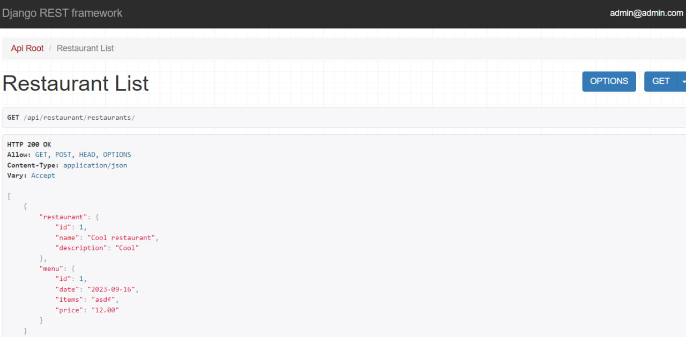

# Restaurant API Service

Restaurant API Service is a Django-based RESTful API for managing restaurants and menus. It provides endpoints for creating, updating, and retrieving restaurant-related data, as well as user registration and menu management.

## Table of Contents
- [Introduction](#introduction)
- [Features](#features)
- [Installation](#installation)
- [Endpoints](#endpoints)
- [Presentation](#presentation)

## Introduction

Restaurant API Service is designed to streamline the management of restaurant-related data.

### Features:
- Rating system for menus
- Getting menu for current day
- Uploading menu

## Installation

1. Clone the repository:

   ```
   git clone https://github.com/volodymyr-komarnyckyi/restaurant-test
   ```
2. Create .env file and define environmental variables following .env.example:
   ```
   POSTGRES_HOST= your db host
   POSTGRES_DB= name of your db
   POSTGRES_USER= username of your db user
   POSTGRES_PASSWORD= your db password
   POSTGRES_PORT= your db port
   SECRET_key=" your django secret key "
   ```
3. Run command:
   ```
   docker-compose up --build
   docker ps
   """Choose the last one id"""
   docker exec -it (id) bash
   python manage.py createsuperuser
   ```
4. App will be available at: ```127.0.0.1:8000```

## Endpoints
   ```
   "restaurant" : 
                   "http://127.0.0.1:8000/api/restaurant/restaurants/"
                   "http://127.0.0.1:8000/api/restaurant/restaurants/<int:pk>/"
                   "http://127.0.0.1:8000/api/restaurant/menus/"
                   "http://127.0.0.1:8000/api/restaurant/menus/<int:pk>/vote/"
                   "http://127.0.0.1:8000/api/restaurant/menus/<int:pk>/result"
                   "http://127.0.0.1:8000/api/restaurant/menus/get-today-menu/"
   "employee" : 
                   "http://127.0.0.1:8000/api/user/register/"
                   "http://127.0.0.1:8000/api/user/me/"
                   "http://127.0.0.1:8000/api/user/token/"
                   "http://127.0.0.1:8000/api/user/token/refresh/"
   "documentation": 
                   "http://127.0.0.1:8000/api/doc/"
                   "http://127.0.0.1:8000/api/swagger/"
                   "http://127.0.0.1:8000/api/redoc/"
   ```

## Presentation



